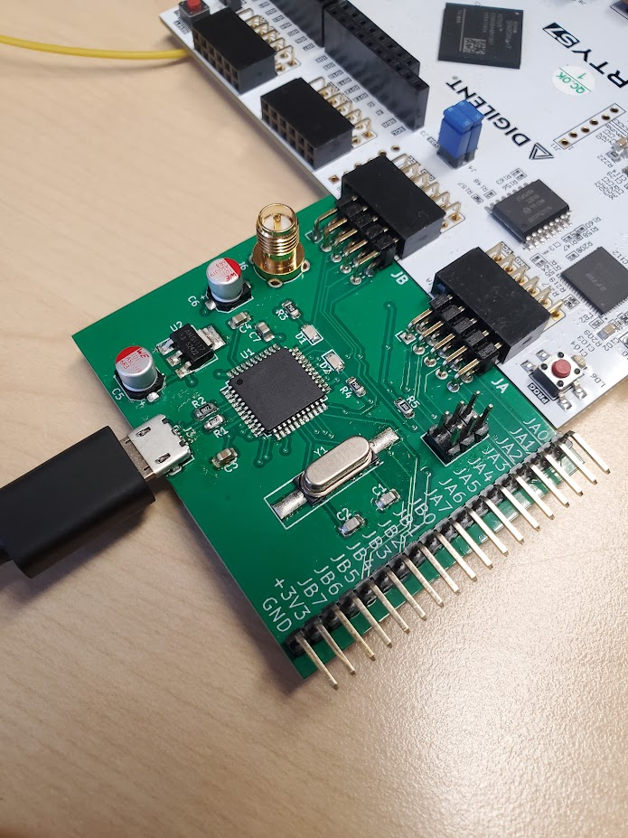
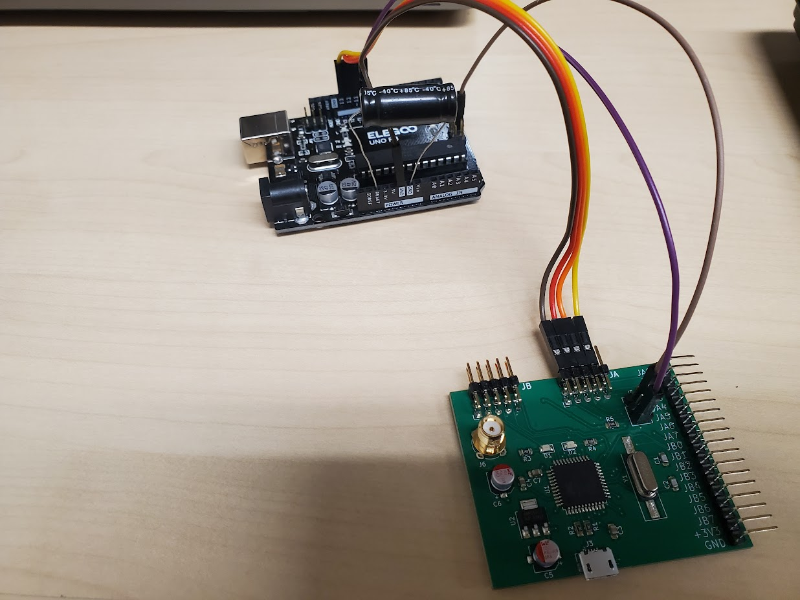
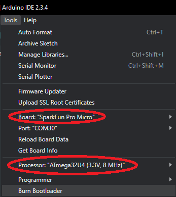
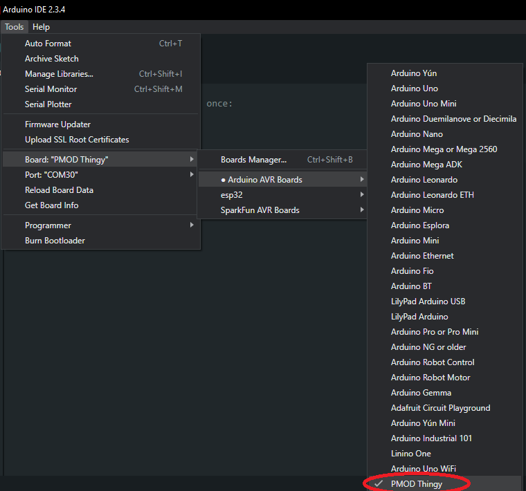

# PMOD-Thingy



PMOD Thingy is, essentially, an Arduino Leonardo modified and repackaged to interface with basically any Digilent FPGA board via the PMOD headers. I designed it to streamline hardware security experiments done by myself and my colleagues at WPI Vernam Lab, where we'd use a 3.3V Arduino board to interface with an FPGA through the PMOD headers.

**Note: this is a custom board with a different pinout and clock frequency from a typical Arduino, so you must follow the setup procedure before use!**

## Pinouts

```
                  (top edge of board)
_______________________________________________________
-----------------------         -----------------------
| GND JB3 JB2 JB1 JB0 |         | GND JA3 JA2 JA1 JA0 |
| GND JB7 JB6 JB5 JB4 |         | GND JA7 JA6 JA5 JA4 |
-----------------------         -----------------------
```

| PMOD header | Digital I/O pin | Atmega32U4 pin |
|:------------|:----------------|:---------------|
| JA0         | 0               | PB0            |
| JA1         | 1 / SPI SCK     | PB1            |
| JA2         | 2 / SPI MOSI    | PB2            |
| JA3         | 3 / SPI MISO    | PB3            |
| JA4         | 4               | PB4            |
| JA5         | 5               | PB5            |
| JA6         | 6               | PB6            |
| JA7         | 7               | PB7            |
| JB0         | 8 / I2C SCL     | PD0            |
| JB1         | 9 / I2C SDA     | PD1            |
| JB2         | 10 / UART RX    | PD2            |
| JB3         | 11 / UART TX    | PD3            |
| JB4         | 12              | PD4            |
| JB5         | 13              | PD5            |
| JB6         | 14              | PD6            |
| JB7         | 15              | PD7            |

Although you can use the digital I/O numbers, there are macros for the PMOD headers, so you don't have to keep track of which header connects to which pin.

```cpp
// output 0 on JA6
pinMode(JA6, OUTPUT);
digitalWrite(JA6, LOW);

// input on JB2
pinMode(JB2, INPUT);
if (digitalRead(JB2) == HIGH)
	Serial.println("1 on JB2");
else
	Serial.println("0 on JB2");
```

Each PMOD header is also connected to a single port on the Atmega32U4, which means you can also read and write them bytewise using the data direction and port registers if that is more your speed. There are the macros `PORT_JA`, `DDR_JA`, `PORT_JB`, and `DDR_JB` for that purpose. This makes reading and writing multiple bits much, much faster The code snippet below does the same as the one above...

```cpp
// output 0 on JA6
DDR_JA |= (1<<6);
PORT_JA &= ~(1<<6);

// input on JB2
DDR_JB %= ~(1<<2);
if (PORT_JB & (1<<2))
	Serial.println("1 on JB2");
```

## Burning the bootloader

You can burn the bootloader to the PMOD thingy as you would any other Arduino board through the Arduino IDE. I prefer to do this with [another Arduino running ArduinoISP](https://docs.arduino.cc/built-in-examples/arduino-isp/ArduinoISP/) personally. It doesn't actually matter if you use a 3.3V or a 5V board, so long as you do not connect the PMOD Thingy to any other power source (i.e. USB) while using it. Just remember the capacitor between reset and ground!

**PLEASE NOTE: I MADE A MISTAKE!** If you have one of the original v1 boards I made, I mixed up the SPI pins, so a few of the ICSP pins (SCK, MOSI, MISO) are wrong, though VCC, GND, and RESET are correct. I corrected the labels for the SPI pins on the schematic in this repository and this readme, but not on the layout and gerber files, so if you make one of these yourself you will have this issue as well. In order to burn the bootloader from an Arduino Uno as ISP, you need to make the following connections...

| Pin   | Arduino Uno as ISP | PMOD Thingy V1 |
|:------|:-------------------|:---------------|
| MOSI  | D11 / ICSP-4       | JA2            |
| MISO  | D12 / ICSP-1       | JA3            |
| SCK   | D13 / ICSP-3       | JA1            |
| reset | D10                | ICSP-5         |



The PMOD Thingy runs the same bootloader as the Sparkfun Pro Micro 3.3V / 8MHz, though you can use the bootloader for any Atmega32u4-based Arduino with an 8MHz clock (as opposed to the 16MHz clock most boards run), if any other such boards exist at all. As such, you will need to [install the pro micro board to the Arduino IDE](https://learn.sparkfun.com/tutorials/pro-micro--fio-v3-hookup-guide#windows_boardaddon). Once that is installed, set up and connect your ArduinoISP, select "SparkFun Pro Micro" under *Tools>Board*, select "ATmega32U4 (3.3V, 8MHz)" under *Tools>Processor*, then click *Tools>Burn Bootloader*.



## Adding board to Arduino IDE

While you techincally *can* program the PMOD Thingy as a Sparkfun Pro Micro, it has an entirely different pinout from any standard Arduino. As such it needs its own special board definition. Use the following steps to add it...

1. **Open the Arduino AVR platform folder.** The exact location depends on your OS...
	* Windows
		- Arduino IDE 1.x - `C:\Program Files (x86)\Arduino\hardware\arduino\avr`
		- Arduino IDE 2.x - `C:\Users\{username}\AppData\Local\Arduino15\packages\arduino\hardware\avr\1.8.6`
	* macOS - `/Users/{username}/Library/Arduino15/packages/arduino/hardware/avr/1.8.6`
	* Linux - `/home/{username}/.arduino15/packages/arduino/hardware/avr/1.8.6`

2. **Modify `boards.txt`.** Paste the contents of `arduino_ide_config/boards_addon.txt` to the bottom of `boards.txt`

3. **Add a `pins_arduino.h` variant called 'pmodthingy.'** In the `variants` folder, create a folder called `pmodthingy` and paste `arduino_ide_config/pins_arduino.h`

4. **Restart Arduino IDE.** Once that is done, you should see "PMOD Thingy" as an option under *Tools>Board>Arduino AVR Boards*



## A few notes about Serial...

Since the PMOD Thingy has native USB you cannot use the serial port until it is actually open. In practice, this means you must put `while (!Serial) {}` or something after you initialize the serial interface and before you do anything with it. For more info, read the [official Arduino documentation](https://www.arduino.cc/reference/cs/language/functions/communication/serial/ifserial/)

**`SerialEvent()` does not work on Atmega32u4 based boards, such as the PMOD thingy.** However, completely undocumented is the ability to use it anyways with `SerialEventRun()`...

```cpp
// add this to your sketch make serialEvent() work
void SerialEventRun() {
	if (Serial.available())
		SerialEvent();
}
```

[People say using `serialEvent()` is the "wrong" thing to do](https://forum.arduino.cc/t/serialevent-with-the-esplora-leo-micro/173720), but it's what I've always done because I didn't know better at the time, and it works fine for what I usually do.

## "y no analog?"

The PMOD headers on FPGA boards, at least the ones I've used, are digital. Some boards have a PMOD header for XADC, but I've never used them and in fact have no idea how they work (as of writing this). As such, I've completely removed anything to do with analog inputs, though some of the pins are capable of analog and in fact are used as analog I/O on the Leonardo and Pro Micro. 